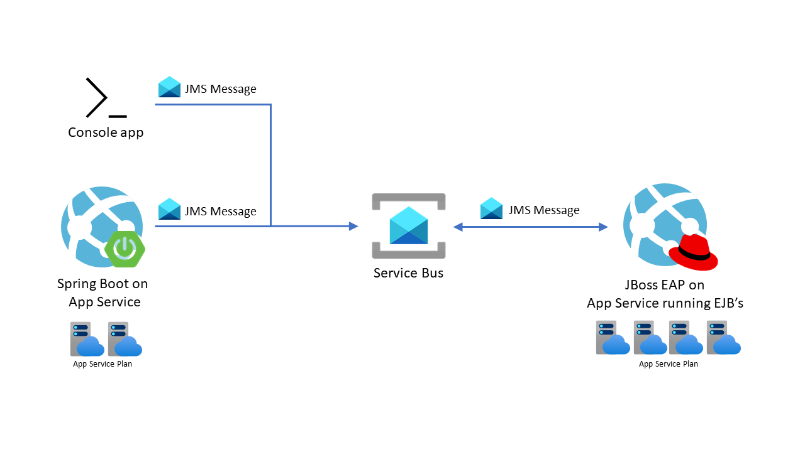

# JMS with JBoss EAP on Azure App Service

This repository contains a sample that demonstrates how a Java EE app can be deployed to a managed JBoss server in App Service. The `frontend-app-payments-client` directory contains a Java SE app that sends JMS messages to Azure Service Bus. The Java EE app in the `backend-app-jbosseap-jms-mdb` directory uses Message Driven Beans for processing JMS messages sent by the Java SE app. When the MDB processes the JMS messages, you will be able to see log messages on the application's stdout (log stream in Azure portal).

## Overview

This sample repository demonstrates how to to deploy a Spring Boot app and JBoss EAP app onto Azure App Service. This repository also deploys an Azure Service Bus Queue to act as a broker for JMS messages between the two applictions. The Spring Boot app publishes mock employee records to the queue, which are consumed and processed by the JBoss site for salary payments. You can also publish messages from a local console app to test the queue.  


> The diagram above shows all the resources that are deployed in this sample, and the relationships between them.

### Directories and files

A quick overview of the contents of this repository

- [backend-app-jbosseap-jms-mdb/](backend-app-jbosseap-jms-mdb/): The JBoss EAP application that will read and process messages from the Service Bus Queue. This directory also contains a shell script to create the App Service Plan, create the JBoss EAP site, and deploy the WAR application to it.
- [frontend-app-payments-client/](frontend-app-payments-client/): The Spring Boot frontend service which publishes messages to the Service Bus Queue. This directory also contains a shell script to create the App Service Plan, create the Java SE site, and deploy the JAR application to it.
- [console-app-jms/](console-app-jms/): A simple command-line Java application to send messages to the Service Bus Queue from your local machine.

## Prerequisites

- An Azure Subscription
- Maven [installed locally](https://maven.apache.org/install.html)
- The Azure CLI [installed locally](https://docs.microsoft.com/cli/azure/install-azure-cli)
- For Windows users, have [Windows Subsystem for Linux](https://docs.microsoft.com/windows/wsl/install-win10) installed. You can confirm WSL is installed by running `wsl` in PowerShell.

## Setup

First, log into the Azure CLI and set the subscription you want to use for this tutorial. Replace `SUBSCRIPTION-ID` with your subscription ID.

```bash
az login

az account set -s SUBSCRIPTION-ID.
```

Next, copy the script templates from `scripts/` to `.scripts/`.

```bash
source scripts/fork.sh
```

## Tutorial

Throughout this tutorial you will run shell scripts that create and configure the Azure resources for you. Run the commands in `bash` on Linux or `WSL` on Windows.

> In a hurry? See the [abridged instructions](abridged-instructions.md).

### Create the resource groups

1. Once the files are copied to `.scripts/`, open [setenv-azure.sh](.scripts/setenv-azure.sh) and replace the placeholder (`__REPLACEME__`) with the string you want to use for the resource group.
1. Run the script to set the resource group and resource names.

    ```bash
    source .scripts/setenv-azure.sh
    ```

### Create the Service Bus Queue

1. Create the Service Bus namespace and queue. This script will also set the *listen* and *send* authorizations on the queue.

    ```bash
    source .scripts/configure-servicebus.sh
    ```

2. The next script will copy the Service Bus SAS Key and set it as an environment variable. This SAS key will be set as an environment variable on the web app in the next section.

    ```bash
    source .scripts/setenv-servicebus.sh
    ```

3. Now you can run the console application (in [console-app-jms](console-app-jms/)) to test the Service Bus queue. The command below will build the Java console app, start it, and send 4 messages to the queue.

    ```bash
    mvn -f console-app-jms/ clean compile exec:java \
    -Dexec.cleanupDaemonThreads=false \
    -Dmessage.content=TestMessage \
    -Dmessage.count=4
    ```

    There will be a lot of output from Maven showing the dependency installation and build progress. At the very end you should see the output shown below. You can see that the application queued 4 messages, then read them from the queue in a separate process.

    ```log
    Oct 20, 2020 11:51:58 AM org.jboss.as.quickstarts.jms.HelloWorldJMSClient main
    INFO: Sending 4 messages with content: TestMessage
    Oct 20, 2020 11:51:59 AM org.jboss.as.quickstarts.jms.HelloWorldJMSClient main
    INFO: Received message with content TestMessage
    Oct 20, 2020 11:51:59 AM org.jboss.as.quickstarts.jms.HelloWorldJMSClient main
    INFO: Received message with content TestMessage
    Oct 20, 2020 11:51:59 AM org.jboss.as.quickstarts.jms.HelloWorldJMSClient main
    INFO: Received message with content TestMessage
    Oct 20, 2020 11:51:59 AM org.jboss.as.quickstarts.jms.HelloWorldJMSClient main
    INFO: Received message with content TestMessage
    ```

    If you ran into a problem, please [file an issue](https://github.com/Azure-Samples/jboss-on-app-service-jms/issues/new).

### Create the web apps

Now it's time to create the Spring Boot and JBoss EAP sites on App Service. The Spring Boot app will act as a frontend which sends messages to the JBoss EAP site for processing. Run the script below to create the JBoss EAP site, build the WAR app, and deploy it to the site. You can read the script for more information.

Switch directories into the `backend-app-jbosseap-jms-mdb` directory and run the script as shown below.

```bash
cd backend-app-jbosseap-jms-mdb/
source run.sh
```

> Because of the way the script deploys the JBoss app, it takes around 5 minutes for the app to be fully up and running.

When the JBoss EAP site is up, run the script below to create the Java SE site, build the Spring Boot app, and deploy it.

```bash
cd frontend-app-payments-client
source run.sh
```

## Demo

Now that the resources are deployed...

## Clean up

```bash
TODO
```

## Notes

- Disclaimer about authorization.
- Best practices around Service Bus authorization
- 
